<div align="center">

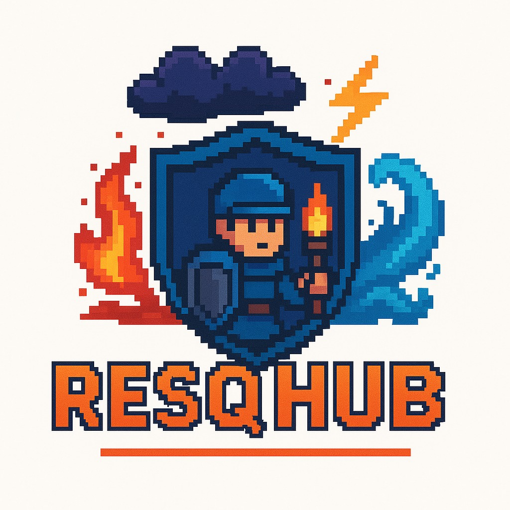

# 🆘 ResQHub

**Learn it. Play it. Survive it.**

A gamified disaster-preparedness and response education platform built for the [Smart India Hackathon](https://sih.gov.in/), under the problem statement **"Disaster Preparedness and Response Education System for Schools and Colleges."** ResQHub reimagines school/college disaster-safety training — moving beyond static drills and pamphlets into interactive, animated mini-games, bite-sized lessons, and real-time information tools.

[](#-tech-stack)
[](#-tech-stack)
[](#-tech-stack)
[](#-tech-stack)
[](#-license)

</div>

---

## 📖 Overview

Traditional disaster-preparedness education in schools and colleges tends to be limited to occasional fire drills and one-off lectures, with little that keeps students genuinely engaged or retaining what they've learned. **ResQHub** was built to close that gap.

Instead of static PDFs and dry safety pamphlets, students learn how to respond to earthquakes, floods, wildfires, landslides, and cyclones through **animated, interactive games**, quick-reference **learning modules**, a live **news feed**, **regional emergency contacts**, and an instant **SOS alert** system — all wrapped in a clean, mobile-friendly PWA that institutions can roll out to their students.

> 🎥 *Demo video coming soon*

## 🎯 Problem Statement

> **Disaster Preparedness and Response Education System for Schools and Colleges**
> *Smart India Hackathon (SIH)*

Educational institutions need an engaging, scalable way to teach students how to prepare for and respond to natural disasters — one that goes beyond passive drills and actually builds muscle memory for real emergencies. ResQHub addresses this by combining **gamified learning**, **quick-access safety information**, and **emergency response tools** into a single platform students can use on any device, in the classroom or on their own.

---

## ✨ Features

### 🎮 Disaster Preparedness Arcade
Interactive, animated games that teach survival skills through play rather than lectures:

| Game | Description |
|---|---|
| ⏱️ **Crisis Countdown** | Timed, scenario-based decision game — *Flood*, *Earthquake*, *Landslide*, and *Wildfire* editions. Make the right call before time runs out. |
| 🎒 **Go-Bag Packer** | Pack a survival kit under pressure — learn what actually belongs in an emergency bag. |
| ❤️ **First Responder** | Step-by-step rescue simulations (CPR, hypothermia care, alerting authorities) across multiple disaster scenarios. |

### 📚 Let's Learn
Bite-sized, case-study-driven lessons (e.g. earthquake seismology, P-waves vs S-waves) that connect the *science* of a disaster to the *behavior* that keeps you safe — followed by quick knowledge checks.

### 🚨 SOS
One-tap emergency alert system to notify contacts/authorities instantly in a crisis.

### 📞 Emergency Contacts
A searchable directory of national and state/region-specific helplines (NDMA, Police, Fire, Ambulance, Women's Helpline, and more) — auto-filtered by selected region.

### 📰 Live Disaster News
An aggregated, filterable news feed (Earthquake / Flood / Wildfire / Cyclone / All) pulling real-time alerts and reports so users stay ahead of unfolding events.

### 👤 Profiles & Roles
Login/profile system with role-based views (e.g. student vs staff/responder-focused content), so institutions can tailor the experience to different users on campus.

### 📱 Progressive Web App
Installable on mobile and desktop with offline support via a service worker — works like a native app.

---

## 🛠️ Tech Stack

- **Frontend:** HTML5, CSS3, Vanilla JavaScript
- **Styling:** [Tailwind CSS](https://tailwindcss.com/)
- **Backend / Database:** [Firebase](https://firebase.google.com/) (Firestore) — score tracking & data storage
- **PWA:** Web App Manifest + Service Worker for installability and offline support
- **Fonts:** Google Fonts (Inter)

---

## 📁 Project Structure

```
SIH/
├── index.html                  # Landing / home dashboard
├── login.html                  # Authentication
├── profile.html                # User profile
├── roles.html                  # Role selection
│
├── games.html                  # Games hub
├── respondergames.html         # Disaster Preparedness Arcade (game selector)
├── crisis-countdown-flood.html # Crisis Countdown: Flood edition
├── earthquakegame.html         # Crisis Countdown: Earthquake edition
├── floodgame.html              # Flood scenario game
├── landslidegame.html          # Landslide scenario game
├── wildfiregame.html           # Wildfire scenario game
├── bagkit.html                 # Go-Bag Packer game
├── first_aid_game.html         # First Responder game
├── rescue.html                 # Rescue sequencing game
├── scenarios.json              # Game scenario/step data
├── pet_game.js / Avatar.js     # Game logic & avatar system
│
├── learn.html                  # Learning modules
├── news.html / newsapp.js      # Disaster news feed
├── alerts.html                 # Alerts feed
├── emergency_contacts.html     # National & regional helplines
├── feedback.html               # User feedback form
│
├── firebase.js                 # Firebase config & score-saving logic
├── firestore.rules.txt         # Firestore security rules
├── app.js                      # Core app logic
├── service-worker.js           # PWA offline support
├── public/manifest.json        # PWA manifest
└── logo.png, images/, icons/   # Static assets
```

---

## 🚀 Getting Started

### Prerequisites
- Any modern web browser
- A local static server (recommended) — e.g. VS Code Live Server, `python3 -m http.server`, or similar
- A [Firebase](https://console.firebase.google.com/) project if you want score-saving/backend features to work

### Installation

```bash
# 1. Clone the repository
git clone https://github.com/<your-username>/ResQHub.git
cd ResQHub/SIH

# 2. Serve the folder locally
python3 -m http.server 5500
# or use the VS Code "Live Server" extension
```

Then open `http://localhost:5500/index.html` in your browser.

### Firebase Setup (optional, for score saving)

1. Create a project at [Firebase Console](https://console.firebase.google.com/).
2. Enable **Firestore Database**.
3. Replace the config object in `firebase.js` with your own project's credentials:

```js
const firebaseConfig = {
  apiKey: "YOUR_API_KEY",
  authDomain: "YOUR_PROJECT.firebaseapp.com",
  projectId: "YOUR_PROJECT_ID",
  storageBucket: "YOUR_PROJECT.appspot.com",
  messagingSenderId: "YOUR_SENDER_ID",
  appId: "YOUR_APP_ID"
};
```

4. Deploy the provided `firestore.rules.txt` as your Firestore security rules.

> ⚠️ Never commit real production Firebase keys to a public repository — use environment variables or a config file excluded via `.gitignore` for deployment.

---

## 🖼️ Screenshots

| Home Dashboard | Games Hub |
|---|---|
| 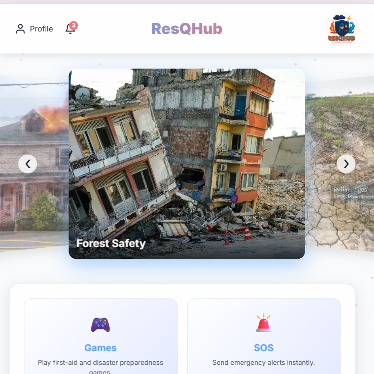 | 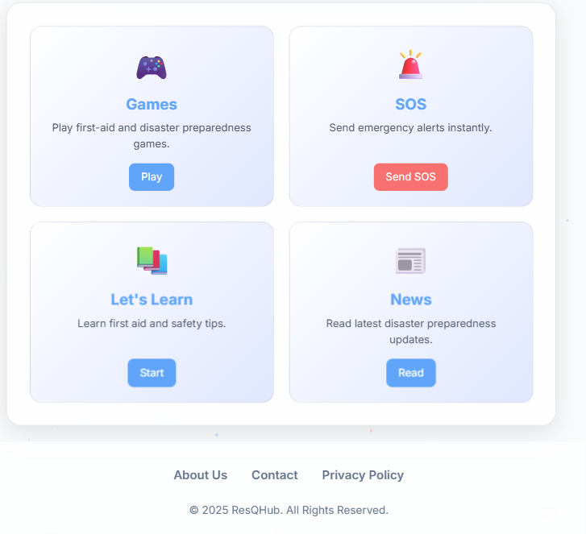 |

| Disaster Preparedness Arcade | Crisis Countdown — Scenario Select |
|---|---|
| 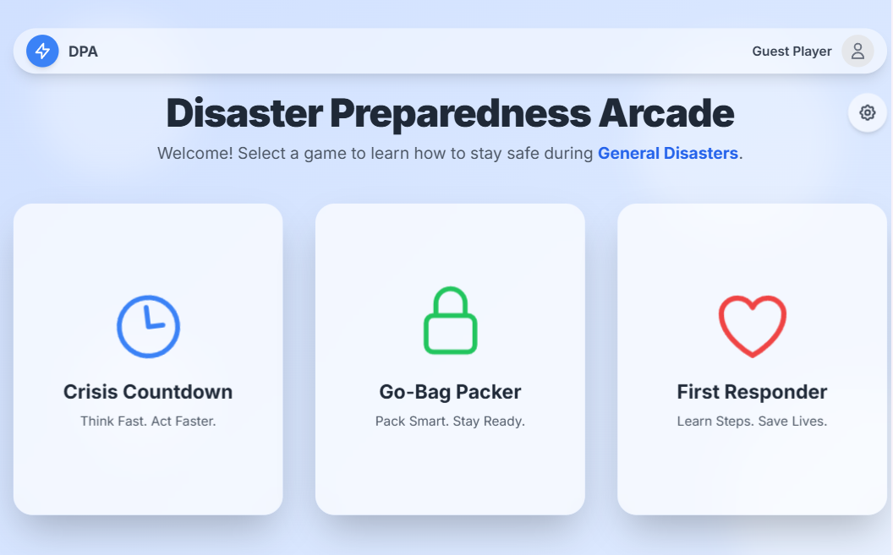 | 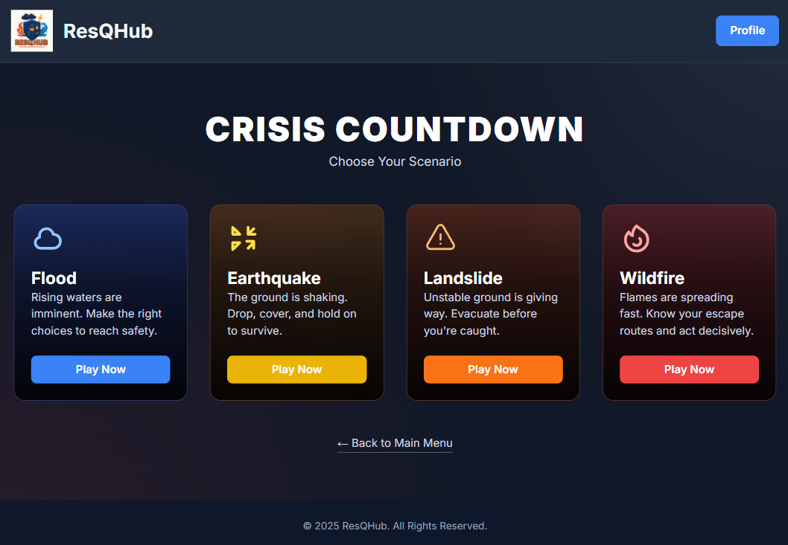 |

| Emergency Contacts | Live News Feed |
|---|---|
| 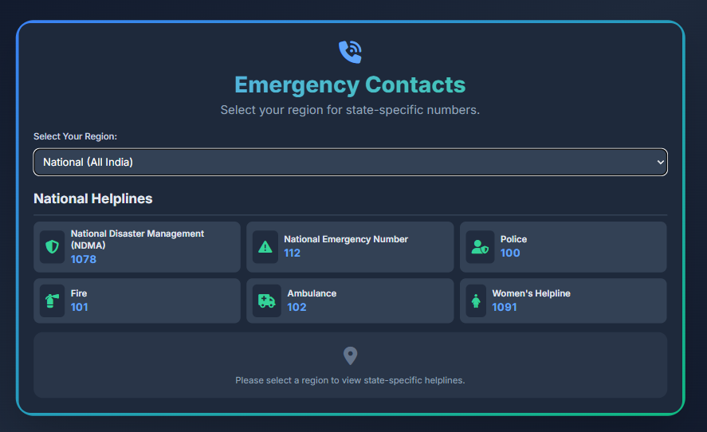 | 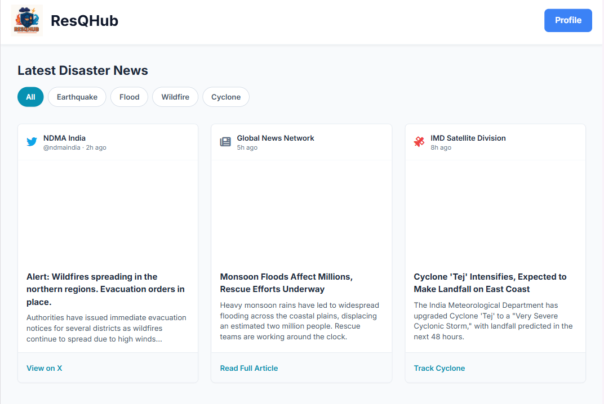 |

| Disaster Learning Module | Crisis Countdown — Gameplay |
|---|---|
| 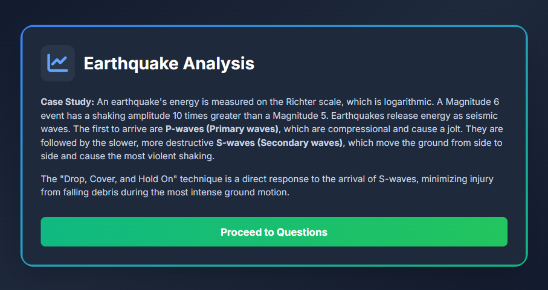 | 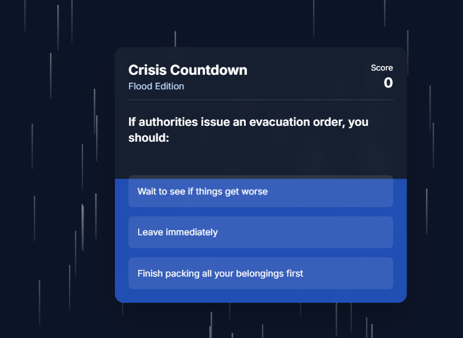 |

| Rescue Simulation | Fisrt Aid — Gameplay |
|---|---|
| 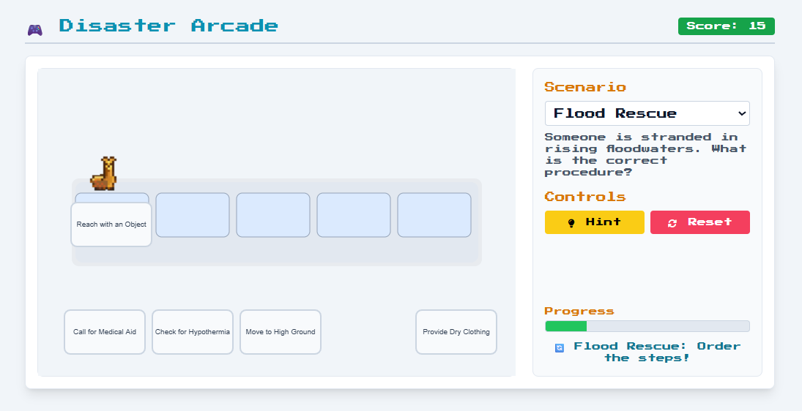 | 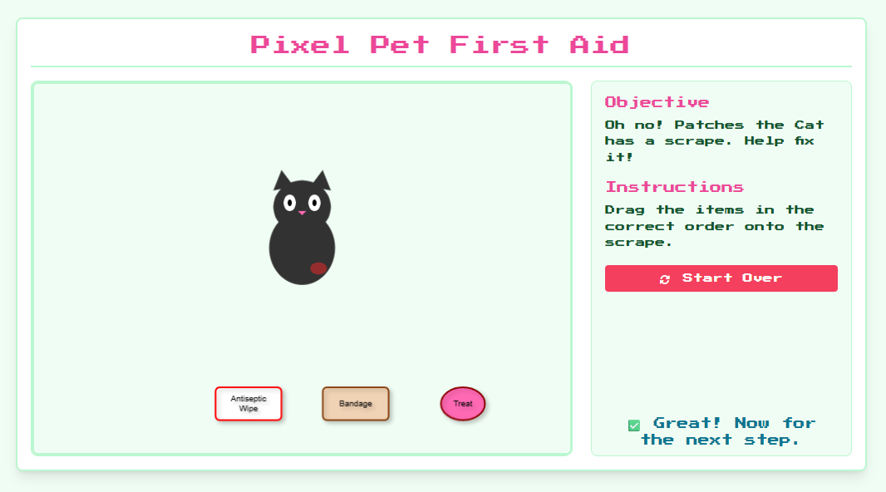 |
| 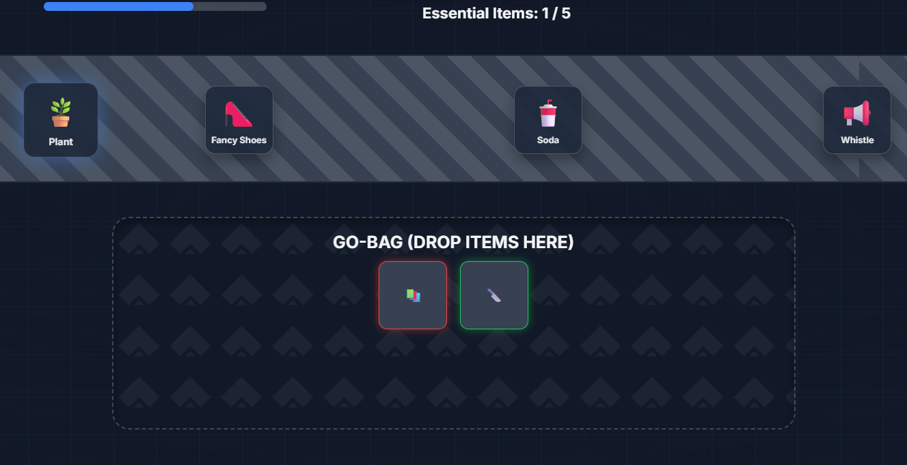 |

## 🎥 Demo Video


## 🗺️ Roadmap

- [ ] Multiplayer / leaderboard support
- [ ] More disaster scenarios (heatwaves, tsunamis, industrial accidents)
- [ ] Multilingual support for wider regional reach
- [ ] Push notifications for real-time disaster alerts
- [ ] Offline-first game caching

---

## 🤝 Contributing

Contributions are welcome! To contribute:

1. Fork the repository
2. Create a feature branch (`git checkout -b feature/amazing-feature`)
3. Commit your changes (`git commit -m 'Add some amazing feature'`)
4. Push to the branch (`git push origin feature/amazing-feature`)
5. Open a Pull Request

---

## 🙌 Acknowledgements

Built for the **Smart India Hackathon (SIH)** under the problem statement *"Disaster Preparedness and Response Education System for Schools and Colleges,"* with the goal of making disaster preparedness education accessible, engaging, and effective for students everywhere.

<div align="center">

**ResQHub** — because preparedness should never feel like homework. 🧡

</div>
